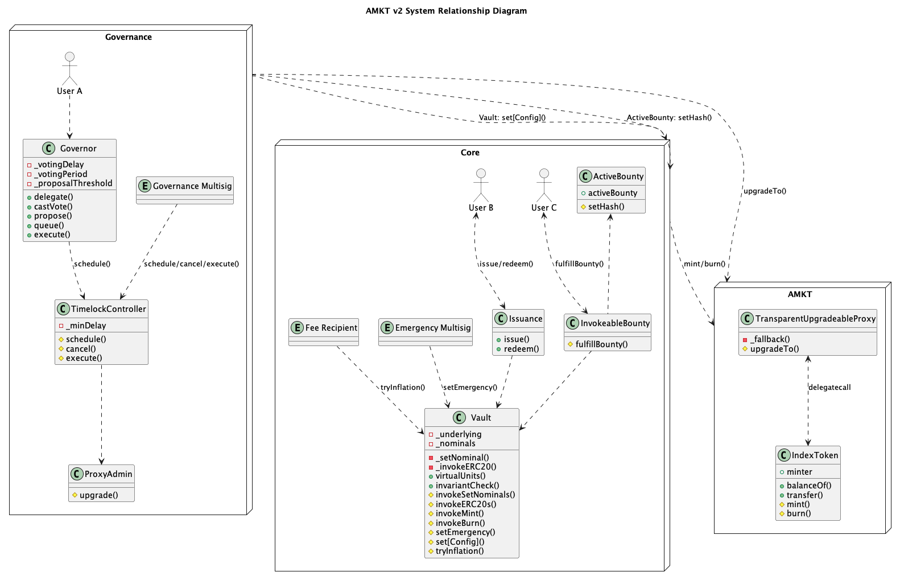

# Alongside Crypto Market Index v2

Alongside Crypto Market Index (AMKT) is a fully backed market index, providing exposure to a market-cap weighted basket of assets, to be rebalanced quarterly.

The next iteration of AMKT moves custody on-chain, relying on `Vault` to custody underlying assets, and on governance to submit accurate `Bounty` for the next set of underlying assets to rebalance.

---

## Overview

### System Relationship Diagram

_This diagram provides a high-level overview of the system and its core functions. While it aims to capture the key components and interactions, it does not encompass the full breadth and depth of the system's functionality._

### AMKT

AMKT is an [Upgradeable](contracts/lib/openzeppelin-contracts-upgradeable/contracts/token/ERC20/ERC20Upgradeable.sol), [Votable](contracts/lib/openzeppelin-contracts-upgradeable/contracts/token/ERC20/extensions/ERC20VotesUpgradeable.sol), ERC20 token on [Ethereum Mainnet](https://etherscan.io/token/0xf17a3fe536f8f7847f1385ec1bc967b2ca9cae8d). It can be issued by bringing a basket of underlying assets, and it can be redeemed to receive a basket of underlying assets, as defined by Issuance and Vault.

### Core

The core system aims to be modular and minimal for maximal safety and extensibility.

- [Vault](contracts/src/Vault.sol): Source of truth for the index and custodian of assets.
  - `virtualUnits()` defines the amount of each asset required in the index.
  - Issuance is authorized to call `invokeERC20s()`, `invokeMint()`, and `invokeBurn()`.
  - InvokeableBounty is authorized to call `invokeERC20s()`, and `invokeSetNominals()`.
  - Fee Recipient is authorized to call `tryInflation()`, which will mint accrued fees to them and adjust `virtualUnits`to account for minted tokens.
  - Emergency Multisig is authorized to call `setEmergency`, which will pause token issuance and rebalance, but cannot not pause redemptions.
  - Governance owns Vault via TimelockController. It's able to change the configurations of the vault, including fee rate, as well as roles.
- [Issuance](contracts/src/invoke/Issuance.sol): Entry point for issuing and redeeming AMKT.

  - `issue()` and `redeem()` are permisionless functions allowing conversion of underlying assets and AMKT.

- [InvokeableBounty](contracts/src/invoke/Bounty.sol): Entry point for rebalancing the index.
  - `fulfillBounty()` is a permissioned function only callable by `fulfiller` of the `Bounty`. It calculates amount of tokens to exchange based on the `Bounty` and facilitates the exchange. It also modifies `virtualUnits` to reflect the rebalance.
  - [ActiveBounty](contracts/src/invoke/ActiveBounty.sol) maintains the currently active bounty. Governance is authorized to call `setHash()`, which will make a `Bounty` active.

### Governance

Governance is responsible for facilitating rebalances, configuring the Vault, and upgrading AMKT. Users can participate in governance with AMKT via [Tally](link-to-tally). Every governance action besides rebalances is subject to a minimum delay of 4 days, enforced by the `TimelockController`.

To prevent against a malicious token Governance takeover, the Governance Multisig is the only entity authorized to cancel and execute transactions scheduled in `TimelockController`.

## Local Development

### Tests

This repo primarily uses [Foundry](https://github.com/gakonst/foundry) for testing.

`cd contracts && forge test`

Additionally, [Halmos](https://github.com/a16z/halmos) is used for symbolic testing.

`cd contracts && halmos`

### Rebalance

`sdk/rebalance` contains an example Rust program to assist users with preparing a rebalance proposal to Governance.

---

## Links

- [Website](https://alongside.xyz/)
- [Twitter/X](https://twitter.com/alongsidefi)
- [Docs](https://docs.amktdao.com/amkt-documentation/)
- [Bug Bounty](https://immunefi.com/bounty/alongside/)
- [DAO Forum](https://discuss.amktdao.com/)
- [DAO Governance](link-to-tally)
- [Arbitrage Bot](link-to-arbitrage-bot)

##
